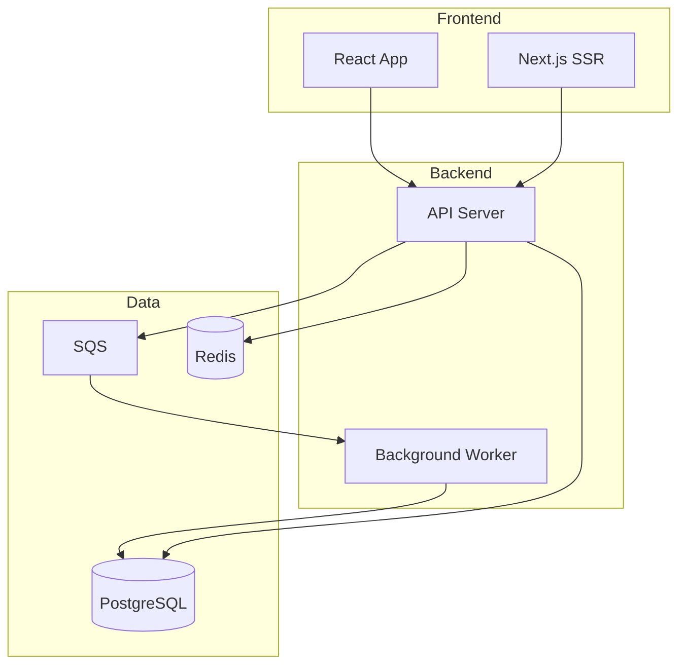
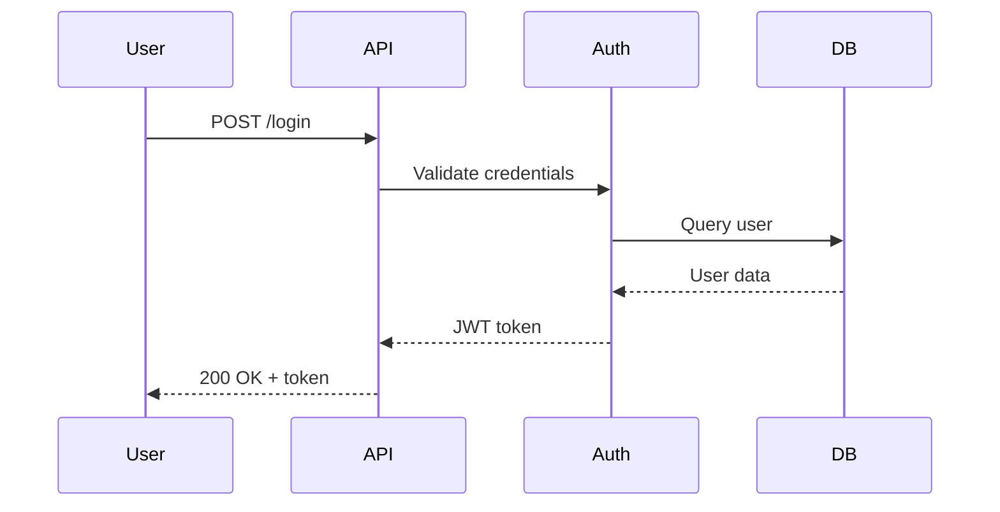
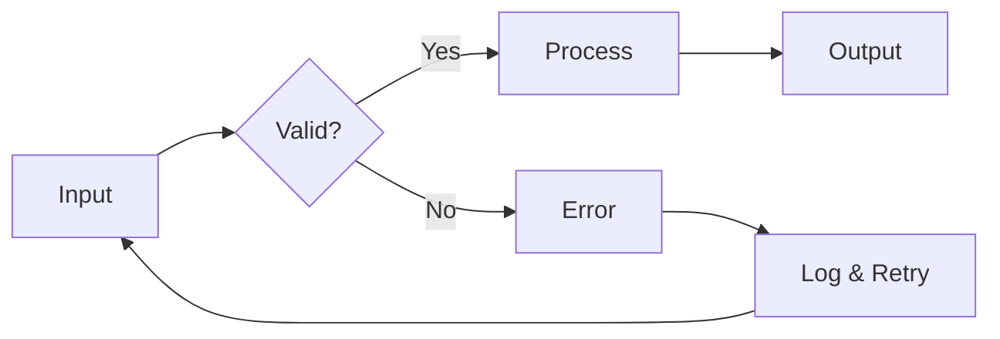

# Visual Elements Guide

README에 시각적 요소를 추가하여 프로젝트의 첫인상을 극대화하는 방법.

## Table of Contents

- [Screenshots](#screenshots)
- [GIF Demos](#gif-demos)
- [Mermaid Diagrams](#mermaid-diagrams)
- [Logo and Banner Design](#logo-and-banner-design)
- [Tables](#tables)
- [Collapsible Sections](#collapsible-sections)
- [Dark/Light Mode Compatibility](#darklight-mode-compatibility)
- [GitHub Special Features](#github-special-features)

---

## Screenshots

### Sizing and Layout

Always constrain image width for consistent rendering:

```markdown
<!-- Single screenshot, centered -->
<div align="center">
  
</div>

<!-- Side-by-side screenshots -->
<div align="center">
  
  &nbsp;&nbsp;
  
</div>
```

### Best Practices

- Use PNG for UI screenshots (crisp text)
- Use descriptive alt text for accessibility
- Keep file sizes under 500KB (compress with tools like TinyPNG)
- Store images in `docs/images/` or `assets/` directory
- Use relative paths, not absolute URLs (so forks work)

---

## GIF Demos

GIF demos are the most effective way to show a tool in action.

### Recommended Tools

| Tool | Platform | Best For |
|------|----------|----------|
| [vhs](https://github.com/charmbracelet/vhs) | All | Terminal recordings via script |
| [terminalizer](https://github.com/faressoft/terminalizer) | All | Terminal recordings with replay |
| [ScreenToGif](https://www.screentogif.com/) | Windows | GUI screen recording |
| [Gifski](https://gif.ski/) | macOS | High-quality GIF encoding |
| [Peek](https://github.com/phw/peek) | Linux | Simple screen recording |
| [LICEcap](https://www.cockos.com/licecap/) | Win/Mac | Lightweight capture |
| [asciinema](https://asciinema.org/) | All | Terminal recording (web player) |

### VHS Script Example (Recommended for CLI tools)

VHS lets you script terminal recordings declaratively:

```
# demo.tape
Output demo.gif
Set FontSize 14
Set Width 800
Set Height 400
Set Theme "Dracula"

Type "my-tool init my-project"
Enter
Sleep 2s

Type "cd my-project && my-tool run"
Enter
Sleep 3s
```

Run with: `vhs demo.tape`

### GIF Best Practices

- Keep GIFs under 30 seconds (ideally 10-15 seconds)
- Show the "golden path" -- the most common/impressive use case
- Use a clean terminal with readable font size (14px+)
- Start with a brief pause so viewers can orient
- Avoid mouse cursors in terminal GIFs (use keyboard-driven demos)
- Optimize file size: aim for under 5MB
- For longer demos, consider linking to a video instead

### Embedding

```markdown
<div align="center">
  
  <p><em>Creating a new project in 10 seconds</em></p>
</div>
```

---

## Mermaid Diagrams

GitHub renders Mermaid diagrams natively. Use them for architecture,
flows, and sequences without maintaining image files.

### Architecture Diagram

````markdown

````

### Sequence Diagram

````markdown

````

### Flowchart

````markdown

````

---

## Logo and Banner Design

### Logo Placement

```markdown
<!-- Centered logo with controlled size -->
<div align="center">
  
</div>
```

Use SVG for logos (scales perfectly, small file size).
If SVG is not available, use PNG with transparent background.

### Banner Design Tips

- Keep aspect ratio around 3:1 or 4:1 (wide format)
- Include project name in the banner if text is large enough to read
- Use dark + light versions if possible, or use a design that works on both
- Max width: 100% of container (GitHub content area is ~880px)

```markdown
<div align="center">
  <picture>
    <source media="(prefers-color-scheme: dark)" srcset="assets/banner-dark.png"/>
    <source media="(prefers-color-scheme: light)" srcset="assets/banner-light.png"/>
    
  </picture>
</div>
```

---

## Tables

Use tables for structured comparisons and reference data:

```markdown
| Feature | Free | Pro | Enterprise |
|---------|:----:|:---:|:----------:|
| Users   | 5    | 50  | Unlimited  |
| Storage | 1GB  | 50GB| 1TB        |
| Support | Community | Email | Dedicated |
```

Alignment: `:---` left, `:---:` center, `---:` right

---

## Collapsible Sections

Hide verbose content without removing it:

```markdown
<details>
<summary>Click to expand: Advanced Configuration</summary>

Content here -- can include code blocks, tables, and images.

\```yaml
advanced:
  setting: value
\```

</details>
```

Use for:
- Long configuration examples
- Full API reference in shorter READMEs
- Changelog / release notes
- Troubleshooting sections
- Platform-specific instructions

---

## Dark/Light Mode Compatibility

GitHub supports both themes. Make your README work in both:

### Images

```markdown
<picture>
  <source media="(prefers-color-scheme: dark)" srcset="img/logo-dark.svg"/>
  <source media="(prefers-color-scheme: light)" srcset="img/logo-light.svg"/>
  
</picture>
```

### Mermaid Themes

Mermaid diagrams automatically adapt to GitHub's theme.
No extra configuration needed.

### Color Choices

- Avoid pure white (#FFFFFF) backgrounds in images
- Avoid pure black (#000000) text in images
- Use transparent backgrounds for logos and icons
- For charts/diagrams as images, provide both versions or use neutral colors

---

## GitHub Special Features

### Alerts / Callouts

```markdown
> [!NOTE]
> Useful information for users.

> [!TIP]
> Optional advice for better outcomes.

> [!IMPORTANT]
> Key information users need to know.

> [!WARNING]
> Potential issues to be aware of.

> [!CAUTION]
> Critical risks or irreversible actions.
```

### Footnotes

```markdown
This is a statement with a footnote[^1].

[^1]: This is the footnote content.
```

### Task Lists (for roadmaps)

```markdown
## Roadmap

- [x] Core feature A
- [x] Core feature B
- [ ] Feature C (in progress)
- [ ] Feature D (planned)
```

### Keyboard Keys

```markdown
Press <kbd>Ctrl</kbd> + <kbd>C</kbd> to copy.
```

### Mathematical Expressions

```markdown
When $a \ne 0$, the solutions are:
$$x = \frac{-b \pm \sqrt{b^2-4ac}}{2a}$$
```
